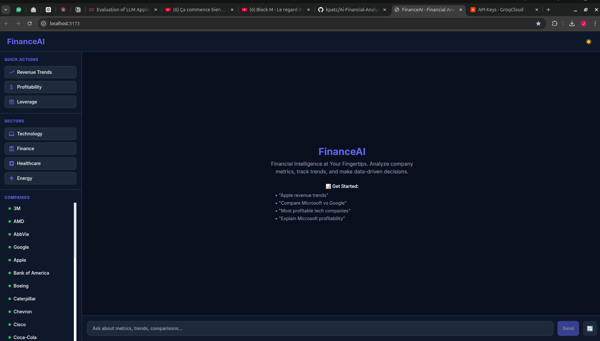
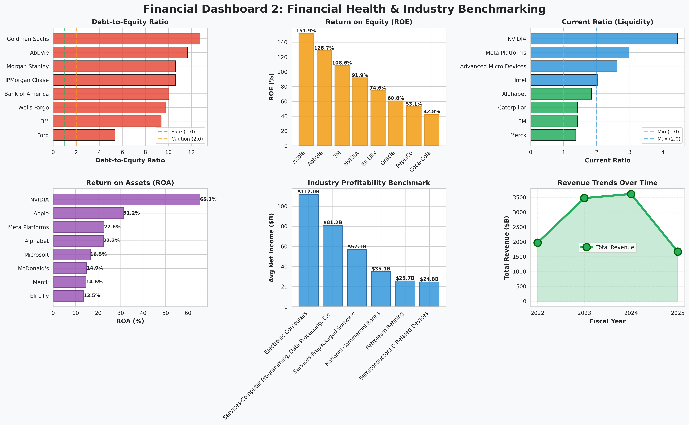

# AI Financial Analyzer

[](https://claude.ai/code)
[](https://nodejs.org/)
[](https://www.python.org/)
[](https://playwright.dev/)
[](LICENSE)

> **Financial Intelligence at Your Fingertips** — Extract, analyze, and explore financial data from SEC 10-K/10-Q filings with an interactive AI-powered chatbot.

A comprehensive financial analysis platform built during the **BCG GenAI Job Simulation** that combines SEC EDGAR data extraction, advanced metrics calculation, and an intelligent chatbot for financial insights.

---

##  Features

-  SEC EDGAR Data Extraction — Automatically extract financial data from 10-K and 10-Q filings for 33+ companies
-  Advanced Financial Analysis — Calculate 30+ financial metrics and ratios including liquidity, profitability, leverage, and efficiency ratios
-  Historical Metrics & Growth Trends — 3-year CAGR calculations and year-over-year analysis
- AI-Powered Chatbot with LangChain — Natural language interface with intelligent conversation memory, topic guardrails, and context-aware responses
-  Conversation Memory — LangChain-powered session memory to remember previous questions in the same session
-  Smart Query Classification — Automatically detect greetings, off-topic queries, and financial questions with targeted responses
-  Interactive Visualizations — Dynamic charts and tables for data exploration
-  Semantic Search — Vector-based search using Sentence-Transformers for contextual queries
-  Production-Ready API — Flask REST API with comprehensive endpoints for data retrieval and analysis

---

##  Interactive Chatbot Interface



The intuitive web-based interface provides real-time financial analysis with:
- Quick action buttons for common analyses
- Company selection with full names
- Sector-based grouping (Technology, Finance, Healthcare, Energy)
- Responsive dark theme UI
- Real-time chart and table generation

---

##  Financial Health Dashboard



Visual benchmark dashboard showing:
- Comparative analysis across companies
- Industry health metrics
- Profitability and leverage ratios
- Historical trends and growth metrics

---

##  System Architecture

```
SEC EDGAR 10-K/10-Q Filings
           ↓
    [Data Extraction Pipeline]
    ├─ Extract financial line items
    ├─ Normalize and validate data
    └─ Store in CSV format
           ↓
    [Financial Analysis Engine]
    ├─ Calculate 30+ metrics & ratios
    ├─ Compute 3-year CAGR
    └─ Generate insights
           ↓
    ┌─────────────────────────────┐
    │  SQLite Database            │
    │  ├─ Companies               │
    │  ├─ Financial Metrics       │
    │  ├─ Financial Ratios        │
    │  └─ Analysis Records        │
    └────────┬────────────────────┘
             │
    ┌────────▼────────────────────┐
    │  Chroma Vector Database     │
    │  (Semantic Search Index)    │
    └────────┬────────────────────┘
             │
    [Chatbot Backend - Flask API + LangChain]
    ├─ Guardrail Chain (Greeting/Off-Topic Detection)
    ├─ Conversation Memory (Session-based)
    ├─ Query Classification (Groq LLM via LangChain)
    ├─ Semantic Search Engine
    ├─ Response Formatting
    └─ Chart/Table Generation
             │
    [React Frontend - Vite]
    ├─ Material-UI Components
    ├─ Chart.js Visualizations
    └─ Real-time Chat Interface
```

---

##  Quick Start

### Prerequisites
- Python 3.9+ with pip
- Node.js 18+ with npm
- SEC EDGAR API credentials (name and email)

### Installation

1. **Clone and setup environment:**
```bash
cd /path/to/Ai-Financial-Analyzer
python -m venv venv
source venv/bin/activate  # On Windows: venv\Scripts\activate
pip install -r requirements.txt
```

2. **Configure SEC EDGAR credentials:**
```bash
# Create .env file
echo "SEC_IDENTITY=Your Name your.email@example.com" > .env
```

3. **Initialize databases and extract data:**
```bash
python run_full_pipeline.py
```

### Running the System

**Terminal 1 - Start the backend API (port 5000):**
```bash
cd chatbot
python api.py
```

**Terminal 2 - Start the frontend (port 5173):**
```bash
cd chatbot/frontend
npm install
npm run dev
```

Visit **http://localhost:5173** in your browser to access the chatbot interface.

---

##  Core Components

### 1. Data Extraction Pipeline

The extraction module pulls financial data directly from SEC EDGAR filings using XBRL concepts:

**Key Classes:**
- `ExtractionPipeline` — Orchestrates SEC EDGAR API requests and data retrieval
- Automatic fallback to label-based search for robust data extraction

**Financial Line Items Extracted:**
- Revenue, Net Income, Operating Income
- Total Assets, Liabilities, Shareholders' Equity
- Cash & Cash Equivalents
- Accounts Receivable, Inventory
- Operating Cash Flow, Free Cash Flow
- Stock Shares Outstanding

**Usage Example:**
```python
from data_integration.extraction.extract_10k_data import ExtractionPipeline

pipeline = ExtractionPipeline("Your Name your.email@example.com", "output.csv")
companies = [('MSFT', 'Microsoft'), ('AAPL', 'Apple'), ('GOOGL', 'Alphabet')]
pipeline.extract_batch(companies, years=3)
csv_path = pipeline.save_csv()
```

---

### 2. Financial Analysis Engine

Calculates 30+ financial metrics and ratios with 3-year historical data:

**Profitability Metrics:**
- Gross Profit Margin, Operating Margin, Net Profit Margin
- Return on Assets (ROA), Return on Equity (ROE)
- Return on Invested Capital (ROIC)

**Liquidity Ratios:**
- Current Ratio, Quick Ratio, Cash Ratio
- Operating Cash Flow Ratio

**Leverage Ratios:**
- Debt-to-Equity, Debt Ratio
- Interest Coverage Ratio
- Debt-to-Assets

**Efficiency Ratios:**
- Asset Turnover
- Receivables Turnover & Days
- Inventory Turnover & Days

**Growth Metrics:**
- Revenue CAGR (3-year)
- Net Income CAGR (3-year)
- YoY Growth Rates

**Usage Example:**
```bash
cd data-integration
python analysis/analysis_calculator.py
```

Generates analysis CSVs in `data/analysis/`:
- `comparative_by_category.csv`
- `comparative_by_industry.csv`
- `financial_ratios_analysis.csv`
- `yoy_growth_analysis.csv`
- `profit_margin_analysis.csv`

---

### 3. Interactive Chatbot (LangChain-Powered)

Natural language interface powered by **LangChain** with **Groq LLM** (or Google Generative AI) backend:

**Agent Capabilities:**
- **Conversation Memory** — Remembers previous questions within a session
- **Intelligent Guardrails** — Automatically detects and responds to greetings, redirects off-topic queries
- **Context-Aware Responses** — Maintains conversation history for coherent multi-turn interactions
- **Query Classification** — Categorizes financial questions for targeted analysis

**Query Types Supported:**
- Revenue trends and analysis
- Profitability metrics
- Liquidity position
- Leverage analysis
- Operational efficiency
- Historical comparisons
- Multi-company analysis

**Response Features:**
- Concise responses (2-3 sentences) by default
- Detailed explanations when user requests deeper insight
- Dynamic chart generation for trends
- Data tables for metric comparisons
- Source citations and data references
- Friendly greetings with context on available analyses

**Example Queries:**
- "Hello!" → Friendly greeting with info on available analyses
- "What is Apple's revenue trend?"
- "Compare Microsoft vs Google profitability"
- "Show liquidity ratios for tech companies"
- "What did I ask first?" → Recalls conversation history
- "Explain Tesla's debt situation"


---

##  Technology Stack

### Backend
- **Python 3.9+** — Core programming language
- **Flask** — REST API framework
- **SQLAlchemy** — ORM for database operations
- **LangChain** — AI agent framework for conversation memory, guardrails, and LLM orchestration
- **ChromaDB** — Vector database for semantic search
- **Sentence-Transformers** — Embedding model (all-MiniLM-L6-v2)
- **Groq API** / **Google Generative AI** — LLM providers for query analysis and response generation
- **edgartools** — SEC EDGAR API client
- **Pandas** — Data manipulation and analysis

### Frontend
- **React 18** — UI framework
- **Vite** — Build tool and dev server
- **Tailwind CSS** — Utility-first CSS
- **Material-UI** — Component library
- **Chart.js** — Data visualization
- **Axios** — HTTP client

### Database
- **SQLite** — Relational database (default)
- **ChromaDB** — Vector database for semantic search
- **PostgreSQL** — Alternative relational database (configurable)

---

## ⚙️ Configuration

### Environment Variables (.env)

```bash
# SEC EDGAR API
SEC_IDENTITY=Your Name your.email@example.com

# Database Type
DATABASE_TYPE=sqlite

# PostgreSQL (optional)
DB_HOST=localhost
DB_PORT=5432
DB_USER=postgres
DB_PASSWORD=your_password
DB_NAME=financial_data

# Groq LLM
GROQ_API_KEY=your_groq_api_key

# Vector DB
CHROMA_COLLECTION=financial_documents
```

### Key Configuration Files

**data-integration/config.py:**
- EXTRACTION_CONFIG — SEC EDGAR API settings, XBRL concept mappings
- ANALYSIS_CONFIG — Metrics calculation, visualization flags
- DATABASE_CONFIG — SQLite/PostgreSQL settings
- VECTOR_DB_CONFIG — ChromaDB and embedding model settings

**chatbot/config.py:**
- NLP model and embedding settings
- Flask and CORS configuration
- Query categories and metrics configuration
- System prompt for LLM responses

---


**VectorIndexLog**
- Tracks vector database synchronization and embeddings

---

##  Usage Examples

### Example 1: Query a Company's Profitability

```
User: "What is Microsoft's profitability trend?"

Chatbot Response:
Microsoft's net profit margin improved from 26% (2022) to 28% (2024), 
driven by strong cloud growth. ROE increased to 38% in 2024.

[Chart: Net Profit Margin trend over 3 years]
```

### Example 2: Compare Companies

```
User: "Compare Apple vs Microsoft efficiency ratios"

Chatbot Response:
[Table: Asset Turnover, Receivables Turnover, Inventory Turnover]
Microsoft shows superior asset efficiency (1.15x) vs Apple (1.02x).
```

### Example 3: Analyze Leverage

```
User: "Show leverage ratios for tech companies"

Chatbot Response:
[Table: Debt-to-Equity, Interest Coverage, Debt Ratio for all tech companies]
Most tech companies maintain conservative leverage, with interest 
coverage ratios above 20x.
```

---

##  Data Sources

- **SEC EDGAR** — official SEC filing database (https://www.sec.gov/edgar/)
- **10-K Forms** — Annual reports with comprehensive financial data
- **10-Q Forms** — Quarterly financial reports
- **Coverage:** 33+ companies across Technology, Finance, Healthcare, and Energy sectors

---

##  Performance & Optimization

- **Vector Search:** ~50ms response time for semantic queries
- **Chart Generation:** <100ms for dynamic visualization
- **Database Queries:** <10ms for relational queries on indexed columns
- **API Response:** <500ms average end-to-end (including LLM inference)


---

**Simulation:** BCG GenAI Job Simulation (Forage)  
**Last Updated:** April 2026

---

**Built with 🤖 AI assistance and financial data intelligence**
